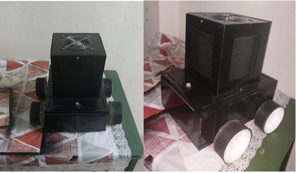
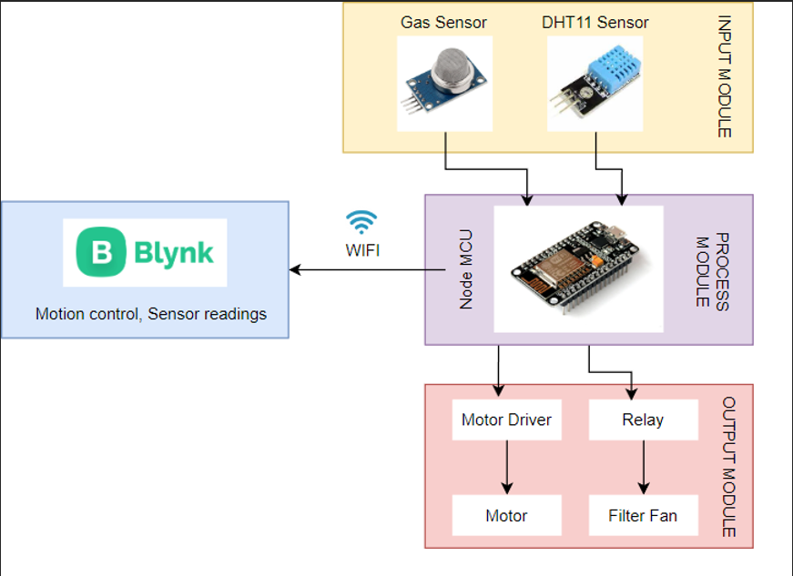
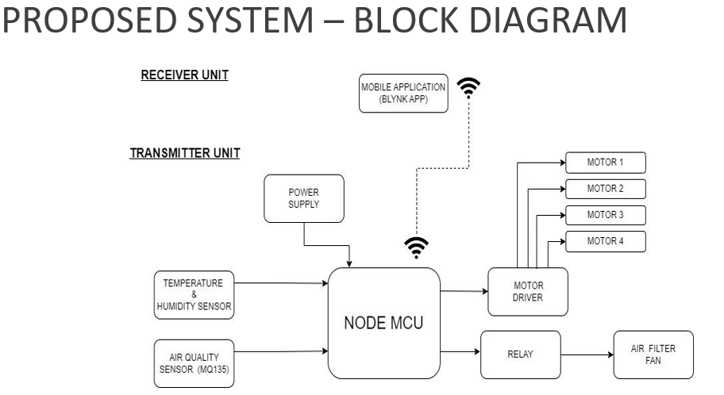
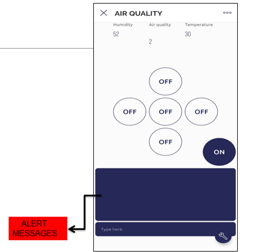

# IoT-Based Air Purification Robot

## Overview
Air pollution is a significant problem in industries, particularly in the **plastic manufacturing sector**, where pollutants pose threats to human health and the environment. This project presents an **IoT-based air purification robot** equipped with advanced sensors, HEPA filters, and IoT connectivity. The robot provides **real-time air quality monitoring** and targeted purification while offering portability, ease of operation, and cost-efficiency. 

The system is designed to address pollution challenges in industrial and domestic settings by combining robotics with air filtration technology, creating a safer environment for occupants.

---

##Model

---

## System Components
| **Component**          | **Description**                                                                 |
|-------------------------|---------------------------------------------------------------------------------|
| **NodeMCU**            | Wi-Fi-enabled microcontroller for IoT integration and system control.           |
| **HEPA Filter**         | Removes fine particulates and airborne pollutants with 99.97% efficiency.       |
| **DHT11 Sensor**        | Measures temperature and humidity for environmental monitoring.                 |
| **Gas Sensor**          | Detects harmful gases like CO, NOx, and smoke for real-time feedback.           |
| **30 RPM DC Motor**     | Powers the robot's mobility with a durable drive system.                        |
| **12V Cooling Fan**     | Facilitates airflow through the filter for efficient pollutant removal.         |
| **Motor Driver (L298N)**| Controls the motors for directional movement.                                   |
| **Relay Module**        | Controls the fan and other high-power components.                               |
| **12V Battery**         | Provides a stable power source for all components.                              |

---

##System Overview

---

## Features
- **Smart Air Purification**: Equipped with HEPA filters to remove 99.97% of pollutants, including dust, pollen, and harmful gases.
- **IoT Integration**: Real-time air quality monitoring and remote control via a smartphone app (Blynk).
- **Mobility**: 4-wheeled drive system for easy navigation and portability.
- **Customizable Operations**: User-controlled purification modes through IoT-enabled commands.
- **Environment Monitoring**: Sensors for temperature, humidity, and gas levels provide actionable insights.
- **Efficient Filtration**: High-performance fans ensure optimal airflow and pollutant removal.

---

##Block Diagram

---

## System Workflow
1. **Air Quality Monitoring**:
   - Sensors measure temperature, humidity, and gas concentration.
   - Data is transmitted to the NodeMCU for processing and remote monitoring.

2. **Targeted Purification**:
   - HEPA filter removes particulates, while a cooling fan ensures airflow.
   - The purification intensity is user-controlled based on air quality levels.

3. **Mobility**:
   - A 4-wheel drive system navigates the robot to areas requiring purification.
   - Motors are controlled via a mobile app with directional commands.

4. **IoT Connectivity**:
   - The Blynk app provides a user interface for remote operation.
   - Users can view air quality data and control the robot in real time.

---

## Technical Specifications
| **Specification**       | **Details**                    |
|--------------------------|---------------------------------|
| **Dimensions**          | 34 x 35 x 37 cm (L x W x H)    |
| **Drive System**         | 4-wheeled drive                |
| **Power Source**         | 12V Lead Acid Battery          |
| **Motor Torque**         | 5.7 Kg-cm                      |
| **Filtration Efficiency**| 99.97% (HEPA filter)           |

---

##Blynk App GUI

---

## Software Architecture
- **Microcontroller**: NodeMCU programmed for IoT communication and hardware control.
- **Mobile Application**: Blynk app for real-time monitoring and control.
- **Programming Language**: C++ for hardware interfacing and communication protocols.

---

## Experimentation and Results
- The robot demonstrated effective pollutant removal with HEPA filters during testing in a simulated industrial environment.
- Real-time air quality data was accurately captured and displayed via the mobile app.
- Mobility tests confirmed smooth navigation and responsive control via IoT-enabled commands.
- Successfully reduced pollutant levels in test environments, highlighting its potential for industrial and domestic applications.

---

## Future Improvements
1. **Localization with SLAM**:
   - Implementing **Raspberry Pi** and **SLAM technology** for mapping unknown environments.
2. **Predictive Models**:
   - Using machine learning for proactive air quality management.
3. **Surveillance Integration**:
   - Adding **ESP32CAM** for monitoring and facial recognition.
4. **Mobile Notifications**:
   - Sending real-time alerts for air quality and system status.
5. **Enhanced Control**:
   - Allowing remote operation through Wi-Fi and Bluetooth connectivity.

---

## Getting Started
### Prerequisites
- NodeMCU microcontroller.
- Required hardware components (listed above).
- Arduino IDE installed on your computer.

### Setup Instructions
1. Assemble the hardware components as per the circuit diagram.
2. Flash the NodeMCU with the provided source code.
3. Install the Blynk app on your smartphone and connect it to the system.
4. Power the robot using a 12V battery and begin testing.
